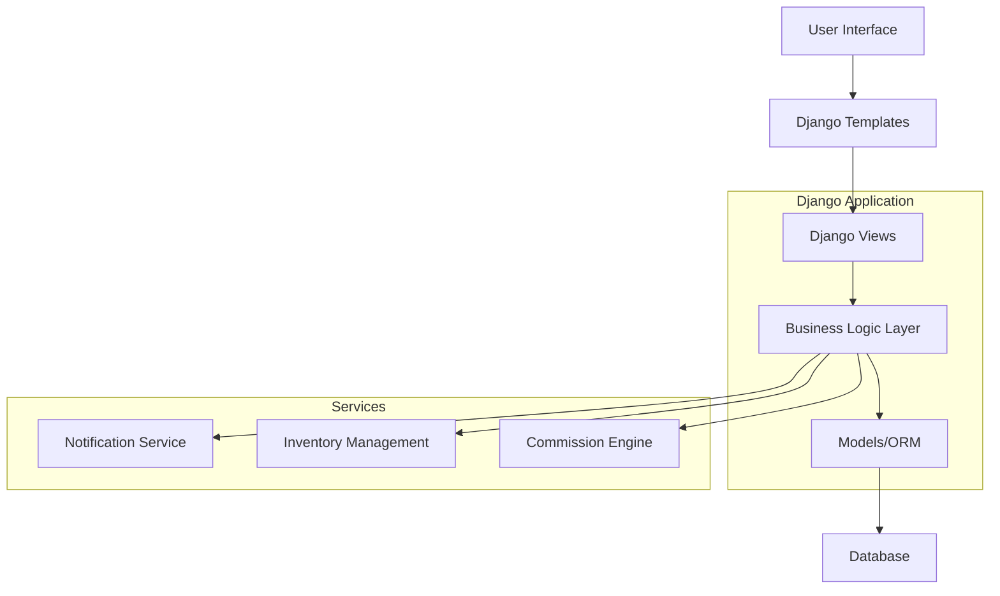
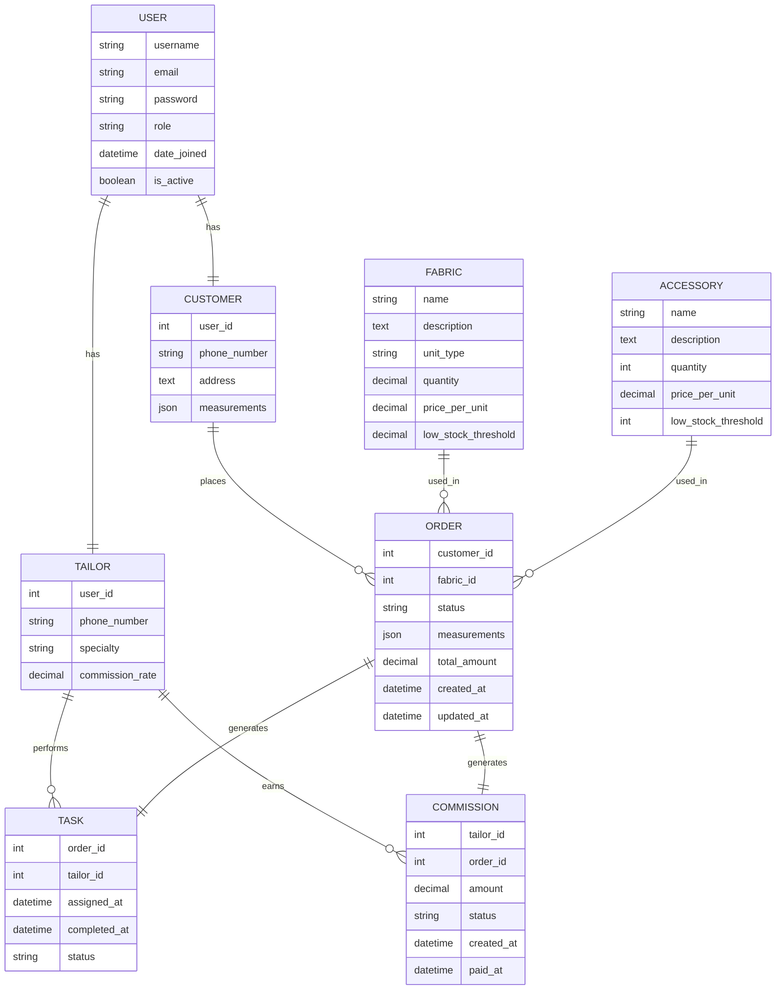
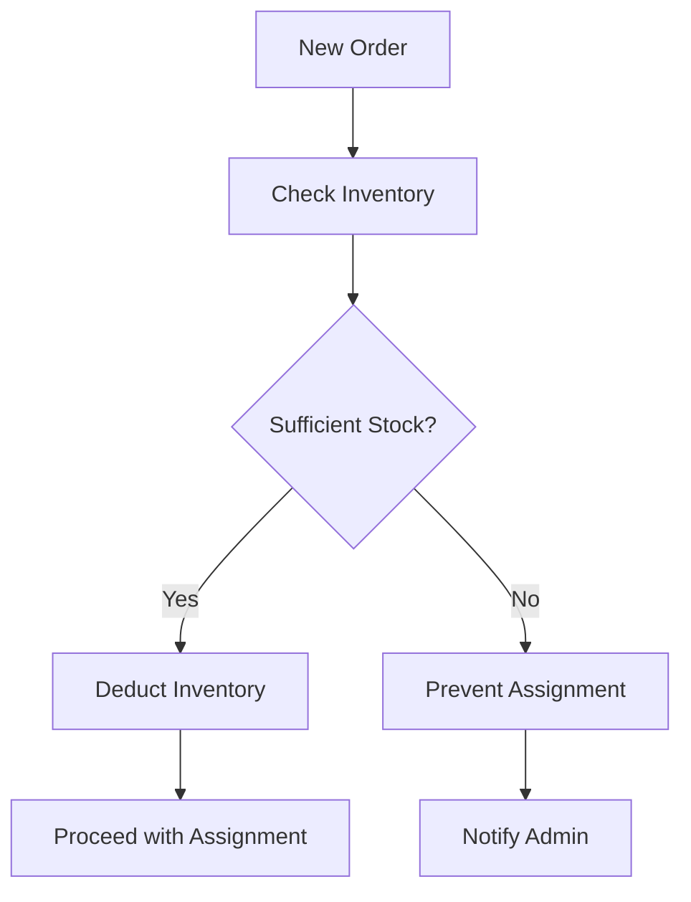

# Stitch Flow – Tailoring Management System Design Document

## 1. Overview

Stitch Flow is a comprehensive web-based tailoring management system designed to streamline the process of order management, tailor assignments, garment inventory tracking, commission-based payouts, and customer notifications. Built with Django, the system provides an efficient solution for tailoring businesses to manage their operations digitally.

### 1.1 Purpose
The system aims to digitize and automate the traditional tailoring workflow by:
- Managing customer measurements and orders
- Assigning tasks to tailors with automated inventory deduction
- Tracking commissions and processing payouts
- Sending automated notifications to customers
- Maintaining real-time inventory of fabrics and accessories

### 1.2 Key Features
- Role-based access control (Admin, Tailor, Customer)
- Task management workflow from measurement to delivery
- Real-time inventory tracking with low-stock alerts
- Commission calculation and payout processing
- Customer notification system
- Responsive web interface

## 2. Architecture

### 2.1 Technology Stack
- **Backend**: Django (Python) with SQLite database
- **Frontend**: HTML/CSS with Django templates
- **Authentication**: Django built-in authentication system
- **Database**: SQLite (development), PostgreSQL (production)
- **Deployment**: Standard Django deployment

### 2.2 System Architecture Diagram

### 2.3 Component Architecture
The system consists of the following main components:
1. **User Management**: Handles authentication and authorization for different roles
2. **Order Management**: Processes customer orders from creation to completion
3. **Inventory Management**: Tracks fabric and accessory stock levels
4. **Task Assignment**: Assigns tailoring tasks to appropriate tailors
5. **Commission System**: Calculates and tracks tailor commissions
6. **Notification Engine**: Sends automated updates to customers

## 3. Data Models

### 3.1 Core Entities

#### User Model (Django Auth User)
- username (String)
- email (String)
- password (String)
- role (Enum: ADMIN, TAILOR, CUSTOMER)
- date_joined (DateTime)
- is_active (Boolean)

#### Customer Model
- user (ForeignKey to User)
- phone_number (String)
- address (Text)
- measurements (JSON)

#### Tailor Model
- user (ForeignKey to User)
- phone_number (String)
- specialty (String)
- commission_rate (Decimal)

#### Fabric Model
- name (String)
- description (Text)
- unit_type (Enum: METERS, YARDS)
- quantity (Decimal)
- price_per_unit (Decimal)
- low_stock_threshold (Decimal)

#### Accessory Model
- name (String)
- description (Text)
- quantity (Integer)
- price_per_unit (Decimal)
- low_stock_threshold (Integer)

#### Order Model
- customer (ForeignKey to Customer)
- fabric (ForeignKey to Fabric)
- accessories (ManyToMany to Accessory)
- status (Enum: PENDING, ASSIGNED, IN_PROGRESS, COMPLETED, DELIVERED)
- measurements (JSON)
- total_amount (Decimal)
- created_at (DateTime)
- updated_at (DateTime)

#### Task Model
- order (ForeignKey to Order)
- tailor (ForeignKey to Tailor)
- assigned_at (DateTime)
- completed_at (DateTime)
- status (Enum: ASSIGNED, IN_PROGRESS, COMPLETED)

#### Commission Model
- tailor (ForeignKey to Tailor)
- amount (Decimal)
- order (ForeignKey to Order)
- status (Enum: PENDING, PAID)
- created_at (DateTime)
- paid_at (DateTime)

### 3.2 Entity Relationship Diagram

## 4. API Endpoints

### 4.1 Authentication Endpoints
| Endpoint | Method | Description | Authentication |
|----------|--------|-------------|----------------|
| `/api/login/` | POST | User login | None |
| `/api/logout/` | POST | User logout | Authenticated |
| `/api/register/` | POST | User registration | None |

### 4.2 Admin Endpoints
| Endpoint | Method | Description | Authentication |
|----------|--------|-------------|----------------|
| `/api/admin/customers/` | GET, POST | List/create customers | Admin |
| `/api/admin/customers/<id>/` | GET, PUT, DELETE | Customer details | Admin |
| `/api/admin/tailors/` | GET, POST | List/create tailors | Admin |
| `/api/admin/tailors/<id>/` | GET, PUT, DELETE | Tailor details | Admin |
| `/api/admin/fabrics/` | GET, POST | List/create fabrics | Admin |
| `/api/admin/fabrics/<id>/` | GET, PUT, DELETE | Fabric details | Admin |
| `/api/admin/accessories/` | GET, POST | List/create accessories | Admin |
| `/api/admin/accessories/<id>/` | GET, PUT, DELETE | Accessory details | Admin |
| `/api/admin/orders/` | GET, POST | List/create orders | Admin |
| `/api/admin/orders/<id>/` | GET, PUT, DELETE | Order details | Admin |
| `/api/admin/tasks/` | GET, POST | List/create tasks | Admin |
| `/api/admin/tasks/<id>/` | GET, PUT, DELETE | Task details | Admin |
| `/api/admin/commissions/` | GET | List commissions | Admin |
| `/api/admin/commissions/<id>/pay/` | POST | Mark commission as paid | Admin |

### 4.3 Tailor Endpoints
| Endpoint | Method | Description | Authentication |
|----------|--------|-------------|----------------|
| `/api/tailor/tasks/` | GET | List assigned tasks | Tailor |
| `/api/tailor/tasks/<id>/` | GET, PUT | Task details and status update | Tailor |
| `/api/tailor/commissions/` | GET | View commissions | Tailor |

### 4.4 Customer Endpoints
| Endpoint | Method | Description | Authentication |
|----------|--------|-------------|----------------|
| `/api/customer/orders/` | GET | View own orders | Customer |
| `/api/customer/orders/<id>/` | GET | Order details | Customer |

## 5. Business Logic Layer

### 5.1 Order Management Workflow
The order management follows a specific workflow:
1. Admin creates customer profile and records measurements
2. Admin creates order with selected fabric/accessories
3. System validates inventory availability
4. Admin assigns order to tailor (task creation)
5. System deducts fabric/accessories from inventory
6. Tailor updates task status upon completion
7. System calculates commission for tailor
8. Admin processes weekly payouts
9. Customer receives notification about order completion

### 5.2 Inventory Management

### 5.3 Commission Calculation
- Commission is calculated as a percentage of the order total
- Percentage is defined per tailor in their profile
- Commissions are generated automatically when tasks are completed
- Admin can view all pending commissions and mark them as paid

### 5.4 Notification System
- Email notifications sent upon order completion
- SMS notifications as alternative channel
- Templates for different notification types
- Configurable notification settings

## 6. Frontend Architecture

### 6.1 UI Components
- Dashboard views for each user role
- Order creation and management forms
- Inventory tracking displays
- Task assignment interfaces
- Commission reporting
- Notification settings

### 6.2 Template Structure
- Base template with common layout
- Role-specific dashboard templates
- Form templates for data entry
- List views for displaying records
- Detail views for individual records

### 6.3 Responsive Design
- Mobile-friendly interface
- Consistent styling across devices
- Accessible interface components

## 7. Security Considerations

### 7.1 Authentication & Authorization
- Role-based access control using Django permissions
- Secure password storage with Django's built-in hashing
- Session management and timeout policies
- CSRF protection for all forms

### 7.2 Data Protection
- Input validation for all user-submitted data
- SQL injection prevention through Django ORM
- XSS prevention through template escaping
- Secure file upload handling for customer data

### 7.3 API Security
- Token-based authentication for API endpoints
- Rate limiting to prevent abuse
- Input sanitization for API requests
- Secure headers implementation

## 8. Testing Strategy

### 8.1 Unit Testing
- Model validation tests
- Business logic function tests
- API endpoint tests
- Commission calculation accuracy tests

### 8.2 Integration Testing
- End-to-end workflow testing
- Inventory management integration tests
- Notification system testing
- Role-based access control testing

### 8.3 UI Testing
- Responsive design testing across devices
- Form validation testing
- User experience flow testing